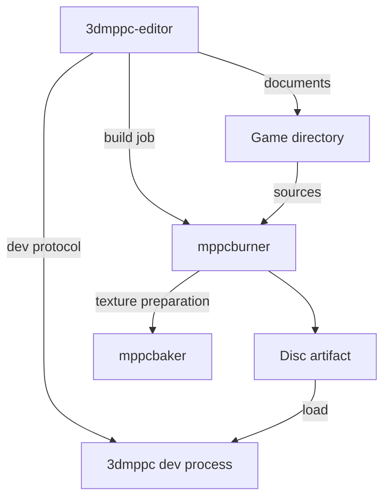

# 3dmppc-editor v0.4: технические требования и критерии приёмки

Версия документа: 1.4. Дата: 2026-09-25. UI-06: интерфейс - растровый шрифт 5x7 из pdklib, код и логи - PxPlus IBM VGA 9x16 в 16 px (ADR-0004); LAY-05: Game по умолчанию Fit; NFR-03: масштаб только целый.

Статус: проект технических требований, сформированный по обсуждению продукта и документации репозитория. Документ задаёт целевое поведение; он не утверждает, что перечисленные возможности уже реализованы. Нумерация v0.4 относится здесь к Editor MVP. Development runtime является его предварительным условием независимо от номера собственного релиза.

## 1. Назначение и границы MVP

`3dmppc-editor` - отдельное настольное приложение и отдельный бинарник для создания и разработки игровых дисков 3dmppc. Рабочее пространство редактора совпадает с директорией игры. Редактор объединяет работу с исходниками, минимальной сценой, ассетами, сборкой и запущенной консолью.

Обязательное ядро: Project, Scene, Hierarchy, Inspector, Viewport, Assets, Console, Build, Run, Pause, Hot Reload. Для законченного цикла разработки также обязательны Text Editor, Files, Terminal, Problems, Run Configuration, Stop и Step Frame.

В MVP не входят специализированные level editor, model editor, animation editor, material editor и audio editor; отладчик C++ с breakpoint/stack/memory; универсальный импорт произвольных проектов; C++ hot swap; магазин плагинов. Scene MVP позволяет собрать простую сцену из готовых объектов и ресурсов, но не моделировать геометрию, рисовать текстуры или создавать анимации.

Уровни требований:

- MUST - обязательное условие приёмки v0.4.
- SHOULD - желательно, отсутствие фиксируется как ограничение релиза.
- ADR - техническое решение, которое нужно документировать до реализации соответствующего блока. ADR не отменяет MUST.

## 2. Архитектура и ответственность процессов

| Компонент | Ответственность | Запрещённое смешение ответственности |
| --- | --- | --- |
| `3dmppc-editor` | Документы, UI, workspace, запуск инструментов, клиент dev-протокола, отображение результатов | Реализация собственной копии runtime, компилятора дисков или baker |
| `3dmppc`, собранная с `3DMPPC_DEVTOOLS=ON` | Исполнение диска, виртуальные бюджеты, кадры, звук, ввод, dev-команды, reload и инспекция | Зависимость от UI редактора, запуск burner/compiler внутри консоли |
| `mppcburner` | Сборка исходников диска, вызов необходимых стадий подготовки, упаковка или unpacked-выход | Зависимость от работающего GUI |
| `mppcbaker` | Подготовка текстур в формат консоли | Исполнение игрового кода или роль универсального asset editor |
| PDK / pdklib | Контракт игры с консолью и дисковые вспомогательные библиотеки | Доступ игры к приватным заголовкам консоли или редактора |
| Проект игры | Исходники, `disc.toml`, ассеты и данные сцены | Обязательная линковка с редактором |



- **ARC-01 MUST:** editor, console и authoring tools собираются отдельными targets. Сборка player console не требует UI-зависимостей, baker или compiler driver.
- **ARC-02 MUST:** editor управляет отдельным процессом runtime. Он не линкует приватную реализацию `src/` консоли и не вызывает игровые hooks напрямую.
- **ARC-03 MUST:** правила форматов, ABI и бюджетов переиспользуются через публичные контракты. Editor не поддерживает независимые расходящиеся копии этих правил.
- **ARC-04 MUST:** штатная сборка выполняется через burner; baker обычно вызывается burner. Прямой вызов baker допустим для изолированного preview/rebake, если используются те же параметры и mapping ресурсов.
- **ARC-05 MUST:** отсутствие burner, baker или runtime блокирует связанные команды с объяснением, но не открытие файлов, Files, Project и остальные панели. nvim - обязательная зависимость Text Editor: без него тайл кода показывает причину.
- **ARC-06 MUST:** crash игры, compiler или baker не завершает editor и не уничтожает несохранённые документы.
- **ARC-07 MUST:** проекты собираются и запускаются из CLI без editor. Player получает диск и обычную консоль, без toolchain и editor.
- **ARC-08 ADR:** выбрать UI toolkit и backend. Dear ImGui является кандидатом, а не уже утверждённым требованием. Выбор должен удовлетворять тайлингу, кастомным IRIX-контролам, нормальному текстовому вводу, кириллице, DPI, clipboard и терминалу. Применение ImGui не означает, что достаточно его стандартной темы или многострочного input.

## 3. Что есть в runtime и что требуется добавить

Основание: документация `master`, прочитанная 2026-09-23. Это проверка описанных интерфейсов, не результат запуска тестов. Перед реализацией нужно закрепить commit/toolchain version.

| Область | Описано в текущей документации | Обязательство редактора или расширение |
| --- | --- | --- |
| Dev build | `3DMPPC_DEVTOOLS=ON`; `--dev` подключает stdin/stdout | Проверка совместимости при старте сессии |
| Исполнение | `status`, `pause`, `resume`, `step`, `quit` | Асинхронный клиент и корректные состояния UI |
| Lua | Reload entry/module, сохранение state в рамках контракта | Сопоставление файла с entry/module, диагностика, режим Manual/On save |
| Assets | Refresh резидентной baked texture | Rebake, публикация результата, затем refresh; неподдерживаемые типы требуют другого действия |
| Инспекция | `get`, `keys` persistent Lua-state | Read-only runtime inspector; это не scene graph и не универсальная reflection |
| Game внутри тайла | CLI/window и финальный dump-frame описаны; поток кадров и remote input в перечне dev-команд не описаны | Новый публичный dev-контракт кадров и ввода либо другой документированный межпроцессный механизм |
| Scene authoring | Общий редактируемый scene document не установлен прочитанной документацией | Формат документа, loader, object IDs и минимальная схема свойств |

Нельзя считать `--dump-frame` транспортом интерактивного viewport. Нельзя объявлять возможность редактирования объектов C++ только потому, что dev-протокол умеет читать Lua-state.

## 4. Workspace, настройки и шаблоны

- **PRJ-01 MUST:** открытие директории с `disc.toml` и открытие самого `disc.toml` приводят к одному workspace. Отдельный обязательный project-wrapper не создаётся.
- **PRJ-02 MUST:** root проекта используется для дерева файлов, поиска, относительных путей, сборки и launch configuration. Перенос директории не ломает project-relative ссылки.
- **PRJ-03 MUST:** `disc.toml` остаётся источником истины для диска. Настройки раскладки, шрифтов и хоткеев не дописываются в игровой manifest.
- **PRJ-04 MUST:** разделить: пользовательские настройки инструментария; переносимые настройки проекта; локальную сессию editor. Имя и формат sidecar-файла определить ADR. Его отсутствие не мешает CLI и открытию проекта.
- **PRJ-05 MUST:** build/cache/log/memcard размещаются в явно выбранных местах. Memcard по умолчанию изолирована для проекта и не использует случайно общую карту рядом с runtime binary.
- **PRJ-06 MUST:** watcher обнаруживает изменения из nvim и других программ, включая сохранение через temporary file + rename. Build/cache исключаются из циклического auto-reload.
- **PRJ-07 MUST:** clean buffer обновляется после внешнего изменения; dirty buffer показывает конфликт с вариантами Compare, Reload from disk, Keep editor version. Перезапись внешней версии требует явного действия.
- **PRJ-08 MUST:** сохранение документов атомарно там, где это поддерживает файловая система. Ошибка записи сохраняет dirty buffer и показывает причину.
- **PRJ-09 MUST:** один workspace и одна управляемая runtime session на окно приложения в MVP. Разные окна не разделяют случайно build-выходы и локальное состояние.

### 4.1. Минимальные диски

- **TPL-01 MUST:** `example-cpp` и `example-lua` становятся каноническими минимальными стартовыми проектами. Они должны содержать только необходимые исходники, manifest, минимальные данные для видимого результата и краткий README.
- **TPL-02 MUST:** New Project принимает Name, Disc ID, Directory, Template. Создание подставляет идентификаторы без повреждения namespace, manifest и entry script. Уже существующие файлы не перезаписываются молча.
- **TPL-03 MUST:** оба шаблона собираются, запускаются и показывают проверяемый минимальный результат после создания. На настроенном toolchain не нужны ручные исправления путей или исходников.
- **TPL-04 MUST:** Lua-шаблон сохраняет необходимый C++ bridge/entry, если он требуется текущей архитектурой. UI не обещает отсутствие compiler только из-за выбора Lua.
- **TPL-05 MUST:** шаблон Lua демонстрирует persistent state и reload; шаблон C++ демонстрирует цикл build/restart. Минимальная scene-capable основа или отдельный минимальный fixture обязательны для приёмки Scene.
- **TPL-06 MUST:** существующий `solid-maid` открывается как файловый workspace без преобразования. Его hardcoded C++-геометрия не превращается автоматически в редактируемые объекты; для этого потребуется явная миграция данных или адаптер.

## 5. Тайловое рабочее пространство

- **LAY-01 MUST:** любой тайл можно разделить горизонтально/вертикально, заменить тип его содержимого, переместить, объединить со вкладками, закрыть и временно развернуть.
- **LAY-02 MUST:** размеры сохраняются отношениями, а не абсолютными ширинами для конкретного монитора. При resize сохраняются пропорции с учётом минимальных размеров содержимого.
- **LAY-03 MUST:** минимальная область изображения Game равна нативному кадру, базово 320x240 при 1x, плюс chrome тайла. Размер берётся из контракта выбранного runtime/диска, если доступен; неизвестное значение не выдаётся за подтверждённое.
- **LAY-04 MUST:** остальные минимумы определяются текстом и контролами. Не навязывать всем тайлам 320x240. Если раскладка не помещается, доступны вкладки/сворачивание и Fit; controls остаются достижимыми.
- **LAY-05 MUST:** Game сохраняет aspect ratio и nearest-neighbor. По умолчанию Fit (решение владельца 2026-09-25): наибольший размер в тайле, масштаб может быть нецелым; Integer и фиксированные 1x/2x/3x выбираются явно. Режим виден в UI и не изменяет логическое разрешение консоли.
- **LAY-06 MUST:** сохраняются именованные layouts, активные вкладки и last workspace. Есть Reset Layout. Повреждённая конфигурация восстанавливается в рабочую раскладку без потери документов.
- **LAY-07 MUST:** предусмотрены стартовые layouts Scene, Code + Game, Debug/Output. Runtime Controls и Run Configuration являются полноценными перемещаемыми тайлами.
- **LAY-08 MUST:** допускаются несколько code panes, terminal sessions и Output-представлений с разными фильтрами. Они не создают дополнительные runtime процессы без явной команды.
- **LAY-09 MUST:** закрытие Game/Output/Controls тайла меняет только представление. Оно не останавливает runtime и не завершает сборку.

### 5.1. Назначение панелей

| Панель | Минимальное содержимое |
| --- | --- |
| Project | Root, manifest, template origin, toolchain health, настройки проекта |
| Files | Реальные файлы/директории, open/create/rename/delete с обработкой dirty documents |
| Assets | Ресурсы проекта, source/output mapping, тип, preview при поддержке, build status |
| Scene / Viewport | Авторская сцена, камера editor, выбор объекта, базовые transform tools |
| Hierarchy | Объекты scene document, стабильные ID, дерево и выделение |
| Inspector | Типизированные свойства authoring-объекта либо явно обозначенное read-only runtime state |
| Game | Реальный кадр 3dmppc, масштаб, capture/focus, состояние сессии |
| Text Editor | Документы, dirty state, поиск, диагностика, позиция курсора |
| Runtime Controls | Build, Run/Resume, Pause, Step Frame, Stop, Hot Reload |
| Run Configuration | Runtime/tools paths, target, аргументы, режим, memcard, reload policy |
| Console / Output | Логи процессов, timestamps, источник, severity, фильтры, копирование |
| Terminal | Реальная shell session с PTY, cwd проекта, ввод и история shell |
| Problems | Ошибки/предупреждения с file:line:column и переходом в документ |
| Search Results | Поиск по проекту и переход к найденной строке |

## 6. Scene, Hierarchy и Inspector

- **SCN-01 MUST:** scene document имеет версию формата, стабильные object IDs, имена, parent references, local transform и типизированные ссылки на поддержанные ресурсы. Не требуется универсальная ECS/reflection.
- **SCN-02 MUST:** формат и loader доступны проекту без editor. На этапе ADR выбрать текстовое представление и место loader в архитектуре; не вводить новый собственный язык ради UI.
- **SCN-03 MUST:** создавать, открывать, сохранять сцену; добавлять и удалять поддержанные объекты; переименовывать; менять position/rotation/scale; назначать существующий ресурс. Минимум поддержанных объектов: transform/group, camera, экземпляр поддержанного drawable ресурса.
- **SCN-04 MUST:** Hierarchy и Viewport синхронизируют selection по ID. Parent cycles запрещены; семантика reparent и local/world transform документирована и проверяема.
- **SCN-05 MUST:** Undo/Redo объединяет изменения Hierarchy, Inspector и gizmo; одно перетаскивание - одна операция. Save/reopen сохраняет ID, связи и значения.
- **SCN-06 MUST:** неподдерживаемые поля не уничтожаются молча при сохранении. Для несовместимой версии документа открывается read-only режим с объяснением.
- **SCN-07 MUST:** authoring state и live runtime state разделены. Изменение gameplay во время Run не переписывает автоматически scene file. Apply Runtime to Scene не входит в MVP.
- **SCN-08 MUST:** live inspector через `get/keys` показывает типы, вложенность, отсутствие значения и усечённые ответы. В MVP он read-only, пока не существует отдельного контракта мутации.
- **SCN-09 MUST:** Scene viewport и Game - разные представления. Wireframe/gizmos принадлежат authoring-view; Game показывает результат runtime. Preview не выдаётся за точное воспроизведение консоли, если использует другой renderer.
- **SCN-10 MUST:** новый scene-capable проект проходит цикл edit -> save -> build -> run, и изменение сцены видно в Game. До scene-reload контракта разрешён явный restart.

## 7. Runtime session и dev-протокол

- **DEV-01 MUST:** editor запускает dev-build `3dmppc` с `--dev`, собственными pipe handles и отслеживает PID/exit code. Обычная player build не считается поддерживаемым backend редактора.
- **DEV-02 MUST:** до активирования команд выполняется `status` и проверка версии протокола. Матрица поддержки зависит от версии, носителя и entry type. Нельзя предполагать существование capability negotiation, которого нет в выбранной версии; при необходимости это отдельное расширение.
- **DEV-03 MUST:** runtime stdin/stdout принадлежат протоколу. Runtime stderr, включая Lua print по текущему контракту, направляется в Output. stdout других tools/terminal сохраняет обычное значение.
- **DEV-04 MUST:** parser поддерживает частичные чтения, несколько ответов в read, request IDs, события ID 0, hex-поля и byte payload. Отдельные лог-строки не интерпретируются как ответы команд.
- **DEV-05 MUST:** UI thread не блокируется на pipe, process wait, compile или reload. Очереди, payload и log history ограничены; переполнение отображается, приложение не растит память бесконечно.
- **DEV-06 MUST:** операции сериализуются там, где порядок влияет на runtime. UI меняет подтверждённое состояние после ответа, а в ожидании показывает pending.
- **DEV-07 MUST:** command timeout не равен доказательству, что команда не исполнилась. После timeout editor показывает неопределённость, пытается восстановить status; опасную повторную команду не отправляет автоматически.
- **DEV-08 MUST:** Pause подтверждается на границе кадра; Step Frame исполняет ровно один кадр и оставляет paused; Resume продолжает. Во время paused editor и protocol остаются отзывчивыми.
- **DEV-09 MUST:** Stop посылает `quit`, ждёт завершения; при зависании предлагает принудительно завершить принадлежащий editor процесс. Закрытие проекта/приложения не оставляет случайно orphan runtime.
- **DEV-10 MUST:** потеря канала, crash, script_error и нормальное завершение различаются в UI. Последние логи и exit reason сохраняются до явного Clear/новой политики сессии.

### 7.1. Встроенный Game и ввод: новый контракт

- **GAM-01 MUST:** Game tile получает кадры именно отдельного процесса 3dmppc. Копия игровой симуляции в editor запрещена.
- **GAM-02 ADR:** определить транспорт framebuffer и input: shared memory/IPC или другой переносимый механизм. Опираться только на reparent чужого native window недостаточно для обещания Linux Wayland/X11.
- **GAM-03 MUST:** контракт кадра содержит размеры, pixel format, stride, sequence/frame ID и правила владения буфером. Torn frames, чтение освобождённой памяти и блокирование runtime медленным UI исключены; устаревшие кадры можно пропускать.
- **GAM-04 MUST:** согласовать источник input и audio output, исключить двойной ввод/звук от editor и окна runtime. Потеря focus/capture отпускает все удерживаемые кнопки и прекращает relative mouse.
- **GAM-05 MUST:** capture включается явно при работе с Game, виден в UI; `Shift+Esc` освобождает ввод. Этот shortcut не передаётся игре. При вводе в код/терминал игра не получает символы случайно.
- **GAM-06 MUST:** Pause сохраняет последний кадр; состояние paused отображается отдельно. Смена размеров тайла не меняет simulation timing или framebuffer budget.
- **GAM-07 MUST:** дополнительные framebuffer/input endpoints входят только в dev-конфигурацию и не требуют editor у player.
- **GAM-08:** отдельное окно runtime допустимо как промежуточный этап разработки, но не заменяет обязательный Game tile при закрытии v0.4.

## 8. Build, упаковка и запуск

- **BLD-01 MUST:** Build запускает `mppcburner` асинхронно; editor задаёт проект, output, baker/PDK/pdklib paths через документированный CLI.
- **BLD-02 MUST:** различаются development output для запуска/reload и упакованный `.mppcdisc` для проверки player. Каталог исходников не подменяется каталогом подготовленного диска.
- **BLD-03 MUST:** compiler/baker/burner ошибки попадают в Output; распознанные file:line:column - в Problems. Нераспознанные строки не теряются.
- **BLD-04 MUST:** Run при dirty documents предлагает Save and Run либо явный запуск сохранённой версии. При изменённых сохранённых входах выполняется необходимая сборка. UI показывает, какой artifact/revision фактически запущен.
- **BLD-05 MUST:** failed/cancelled build не запускает случайно старый artifact под видом нового. Запуск last successful artifact допускается отдельным явно подписанным действием.
- **BLD-06 MUST:** поддержаны отмена build и повторная сборка. Частичные outputs не публикуются как успешный диск. Нельзя перезаписывать загруженный native module/носитель в процессе использования; используются staging/versioned outputs или остановка перед публикацией.
- **BLD-07 MUST:** процессы запускаются с argv, cwd и environment как отдельными значениями. Пути с пробелами и кириллицей работают; ввод пути не превращается в shell-команду. Shell используется только там, где пользователь запускает shell намеренно.
- **BLD-08 MUST:** launcher хранит runtime executable, tools, PDK/pdklib, output, memcard, mode, mute, start paused и поддержанные дополнительные параметры. Противоречивые/неподдержанные параметры объясняются до запуска, когда это можно проверить.
- **BLD-09 MUST:** текущий runtime не останавливается только из-за старта независимой сборки. Замена native artifact требует явного restart, а не скрытой смены процесса.

Документированные примеры формы команд; пути иллюстративные, итоговые argv зависят от конфигурации:

```sh
mppcburner build <project-root> --unpacked <dev-disc-dir> --baker <mppcbaker-path>
3dmppc --dev --paused <dev-disc-dir>
mppcburner build <project-root> -o <output.mppcdisc> --baker <mppcbaker-path>
```

## 9. Hot Reload

| Изменение | Действие MVP | Условие успеха |
| --- | --- | --- |
| Lua entry | `reload entry` или bytes-вариант | Новый код принят runtime; revision изменился; state сохранён по контракту |
| Загруженный Lua module | `reload module <name>` | Имя выведено из mapping, а не угадано по filename |
| Исходник PNG существующей текстуры | Baker -> publish baked bytes -> `asset <name>` | Успешна подготовка, runtime принял refresh |
| Нерезидентная текстура | Подготовка; `resident=0` отражается в результате | UI не обещает немедленное визуальное изменение |
| Резидентный звук/неподдержанный тип | Сообщение Restart required | Нет ложного Reload successful |
| C++ / `disc.so` / manifest / budget | Build and Restart | Пользователь предупреждён о сбросе runtime state |
| Авторская сцена | Save + build/restart до отдельного scene reload | Поведение явно обозначено |

- **RLD-01 MUST:** Manual по умолчанию; On save включается пользователем. Watcher debounce/coalescing не отправляет частично записанный файл и не создаёт бесконечную петлю на output.
- **RLD-02 MUST:** editor хранит source -> disc entry/module/asset mapping. Если burner не предоставляет нужные данные, добавить публичный build mapping вместо дублирования эвристик упаковки в UI.
- **RLD-03 MUST:** compile/body/state-shape failure отображает error token, текст и путь/строку, если доступны. Editor не повышает revision самостоятельно и не перезапускает процесс без согласованного действия.
- **RLD-04 MUST:** отказ reload сохраняет предыдущий принятый код; гарантии state и `effects` передаются точно по runtime-контракту. При `effects=1` UI сообщает о возможных внешних эффектах, не пишет, что вся машина полностью откатилась.
- **RLD-05 MUST:** paused session после reload остаётся paused. Running session не становится paused только из-за локальной догадки UI; состояние берётся из ответа/status.
- **RLD-06 MUST:** ошибка baker не публикует повреждённую текстуру и не вызывает asset refresh. Отказ runtime не уничтожает последнюю рабочую резидентную текстуру.
- **RLD-07 MUST:** изменения объединяются в упорядоченную очередь. Для нескольких Lua-файлов MVP не обещает общей атомарной транзакции; результаты показываются по каждому запросу.

## 10. Текстовый редактор и терминал

- **TXT-01 MUST:** Text Editor - клиент одного процесса `nvim --embed` на окно редактора (ADR-0005); тайл кода - окно этого процесса. Режим по умолчанию задаёт конфиг редактора: старт в режиме вставки, selection Shift+стрелками, системный clipboard, Ctrl+S/C/V/X/Z, Undo/Redo, Save/Save All, find/replace, go to line, line numbers, UTF-8 и кириллица. Работа не требует знания Vim; обычный режим Vim включается одной клавишей.
- **TXT-02 MUST:** подсветка Lua, C/C++, TOML встроенным treesitter nvim; colorscheme в палитре Catppuccin Mocha согласован с nvim-deck и не зависит от оливкового chrome.
- **TXT-03 MUST:** colorscheme, шрифт кода, keymap и language services - отдельные настройки; шрифт кода не зависит от шрифта интерфейса. Конфиг редактора передаётся nvim через `-u`; личный `init.lua` и плагины подключаются только явной опцией.
- **TXT-04 MUST:** tabs/spaces, tab width, wrap, ruler, relative/absolute line numbers и indent guides задаются по языку. Начальный профиль (решение владельца 2026-09-25, его options.lua): пробелы, 2 по умолчанию, 4 для C/C++ с ruler на колонке 129, без wrap; для остальных языков профиль настраивается отдельно.
- **TXT-05 MUST:** diagnostics/completion/hover/go-to-definition через встроенный LSP-клиент nvim для C++ и Lua. Серверы внешние; при их отсутствии редактирование работает, причина отсутствия language features видна.
- **TXT-06 MUST:** Open in External Editor открывает выбранный файл и позицию в настроенном внешнем редакторе. Внешние изменения подхватываются по PRJ-06/PRJ-07.
- **TXT-07 MUST:** редактор знает несохранённые буферы nvim. Закрытие тайла кода с изменённым буфером, который не показан в другом тайле, предлагает Save, Discard или Cancel; закрытие проекта или приложения задаёт тот же вопрос по всем изменённым буферам. Переход из Problems и Search Results открывает файл на строке в тайле кода.
- **TRM-01 MUST:** Terminal - PTY-backed shell с resize, ANSI rendering, Ctrl+C, history/scrollback и изолированной session. Он не получает stdin dev-протокола.
- **TRM-02 MUST:** Output поддерживает фильтры process/source/severity, поиск, copy, clear и ограниченный буфер; доступно сохранение полного лога в файл. Protocol trace скрыт по умолчанию и включается отдельно.

## 11. Визуальная система и компоненты

Цель: профессиональная CGI/CAD workstation эпохи SGI IRIX с цветами раннего Steam/VGUI2. PSX проявляется в контенте и характере консоли. Редактор остаётся читаемым инструментом для длительной работы.

| Token | Значение | Назначение |
| --- | --- | --- |
| Window | `#4c5844` | Основная поверхность |
| Inset | `#3e4637` | Углубления, поля, внутренние области |
| Button | `#4e5744` | Кнопки |
| Selection | `#958831` | Латунное выделение |
| Bevel highlight | `#7e8776` | Верхняя/левая грань |
| Bevel shadow | `#32392c` | Нижняя/правая грань |
| Text | `#d8ded3` | Базовый светлый текст, выбранное проектное значение |
| Code base | `#1e1e2e` | Область кода, Mocha |

- **UI-01 MUST:** единые tokens применяются ко всем экранам. Светлые серо-кремовые поля не заменяют основную палитру.
- **UI-02 MUST:** ступенчатые bevel-рамки, тонкие stippled titlebars, компактные window controls, скошенные вкладки, arrow scrollbars, diamond radio buttons, небольшие bitmap/isometric icons. Без обязательной декоративной текстуры на рабочем тексте, CRT blur и крупных web-карточек.
- **UI-03 MUST:** библиотека компонентов содержит Button/IconButton/Toggle, text field, numeric spinner, dropdown, checkbox/radio, tree/list/table, tab strip, splitter, pane header, menu/context menu, dialog, status indicator, log row и transport bar.
- **UI-04 MUST:** каждый интерактивный компонент имеет normal/hover/pressed/focused/disabled; поля дополнительно invalid/read-only/dirty, где применимо. Disabled control объясняет причину недоступности.
- **UI-05 MUST:** keyboard focus различим; ошибка не кодируется одним цветом; labels не обрезаются без способа прочитать их. UI scale и отдельный размер шрифта поддерживают HiDPI.
- **UI-06 MUST:** шрифт UI и моноширинный шрифт кода/терминала - отдельные настройки на отдельных файлах. UI - растровый шрифт 5x7 в клетке 8x8 из pdklib (`rv_font`, с блоком кириллицы), без масштаба сверх `--scale`; код, терминал и логи - PxPlus IBM VGA 9x16 в 16 px, варианты 32 px и 6x11 (ADR-0004). Поставка конкретного font требует подходящей лицензии и кириллицы.
- **UI-07 MUST:** реализован экран Widget Catalog для ручной проверки всех компонентов и их состояний. Сгенерированные изображения служат направлением дизайна; их вымышленные API, filenames, toolbar-команды и надписи не являются спецификацией.

## 12. Состояния и управление

Состояние runtime и состояние build job независимы. Например, Running + Building допустимо. Dirty documents - третья независимая характеристика; её нельзя спрятать в одном общем enum.

| Состояние runtime | Основные доступные действия | Что показывается |
| --- | --- | --- |
| Stopped | Build, Run | Выбранный target, последний artifact |
| Starting | Cancel/Stop | Процесс подключения и handshake |
| Running | Pause, Stop, поддержанный Reload | Frame/status, capture |
| Pausing / Stepping / Reloading | Stop; остальные по очереди операций | Pending и последняя подтверждённая информация |
| Paused | Resume, Step Frame, Stop, поддержанный Reload | Последний кадр, frame ID |
| Stopping | Ожидание, затем Force stop при зависании | Причина и progress |
| Disconnected / Crashed | Inspect logs, Restart после завершения старого процесса | PID/exit reason, последний кадр помечен как устаревший |

Начальные shortcuts, переназначаемые и доступные через меню:

| Команда | Shortcut |
| --- | --- |
| Save / Save All | Ctrl+S / Ctrl+Shift+S |
| Undo / Redo | Ctrl+Z / Ctrl+Shift+Z |
| Build | Ctrl+B |
| Run / Resume | F5 |
| Pause | F6 |
| Step Frame | F7 |
| Hot Reload | F8 |
| Stop | Shift+F5 |
| Release Game input | Shift+Esc |
| Project search | Ctrl+Shift+F |

Shortcut routing учитывает focused pane. Захваченная игра не перехватывает аварийное освобождение ввода; текстовый editor/terminal не теряет собственные команды из-за глобальных однобуквенных shortcuts.

Обязательные экранные сценарии: No project/New project; Open stopped; Dirty document; Building; Build failed; Running/captured; Paused; Reload success; Reload rejected с сохранённой сессией; Runtime exited/crashed; External edit conflict; Close with unsaved changes; Missing/incompatible toolchain.

## 13. Нефункциональные критерии

- **NFR-01 MUST:** Linux является первой проверяемой платформой. Проверки Game/input выполняются на X11 и Wayland. Поддержка Windows/macOS не объявляется до прохождения тех же сценариев; process/PTY/frame transport изолированы за platform adapters.
- **NFR-02 MUST:** build/reload/output flood не блокируют ввод и перемещение тайлов. Предлагаемый acceptance budget: видимая реакция UI на локальную команду до 100 ms на зафиксированной тестовой машине, без включения времени compiler/runtime в этот бюджет.
- **NFR-03 MUST:** проверять layouts при 1280x720 и 1920x1080, scale 100% и 200% (`--scale 1` и `--scale 2`; масштаб только целый, ADR-0004). На тесном layout допускаются вкладки/сворачивание/Fit; недоступные за пределами окна обязательные кнопки не допускаются.
- **NFR-04 MUST:** limits для логов, protocol buffers, thumbnails и открытых больших файлов заданы явно; при достижении limit есть понятное поведение. Не требуется читать весь проект в память для отображения дерева.
- **NFR-05 MUST:** document save и восстановление сессии не зависят от живого runtime. Локальное восстановление dirty buffers после crash editor SHOULD; silent data loss при обычном закрытии недопустим.
- **NFR-06 MUST:** runtime/tools paths и совместимые версии видны в diagnostics. Изменение исполняемого файла сбрасывает старые предположения о возможностях.
- **NFR-07 MUST:** очистка build/cache ограничена собственными выходами и не удаляет исходники по ошибочному root/path. Внешние symlinks видны; recursive watcher не уходит в циклы.

## 14. Приёмочные сценарии

Все MUST проверяются на зафиксированных версиях editor/runtime/tools. Для каждого сценария сохраняются результат, версия, платформа и воспроизводимые шаги; для визуальных сценариев - screenshots. Следующие проверки являются минимальным release gate.

| ID | Сценарий | Критерий PASS |
| --- | --- | --- |
| AC-01 | Раздельная сборка | Editor, dev runtime, player runtime и tools собираются независимо; player не требует editor |
| AC-02 | New C++: Создать в пути с пробелами/кириллицей, Build, Run | Видимый минимальный результат, без ручной правки файлов |
| AC-03 | New Lua: Создать, Build, Run, Pause, Reload, Step | Новый код работает, persistent counter продолжает значение |
| AC-04 | CLI round trip: Собрать созданный проект burner, запустить диск player | Работает без запущенного/установленного editor |
| AC-05 | Existing workspace: Открыть solid-maid directory и disc.toml | Один root, исходники не преобразованы, ограничения сцены объяснены |
| AC-06 | Relocation: Перенести созданный проект, открыть и собрать | Project-relative ссылки работают |
| AC-07 | Layout: Split/move/tab/save/reopen/reset и сменить размер/DPI | Раскладка восстанавливается; controls доступны; Game не искажён |
| AC-08 | Scene round trip: Add/reparent/transform/undo/redo/save/reopen/build/run | ID/связи/значения сохранены; сцена соответствует изменению |
| AC-09 | Pause/Step: Зафиксировать frame N, Step, запросить status | N+1 и Paused; без самостоятельного второго кадра |
| AC-10 | Embedded Game: Играть в Game tile на X11 и Wayland | Реальный runtime frame, корректные capture/release, нет двойного ввода |
| AC-11 | Focus loss: Удерживать движение и переключиться в код/другое окно | Нет stuck input; набранный текст не уходит игре |
| AC-12 | Good reload: Изменить entry и загруженный module | Результат подтверждён; state сохранён; process не перезапущен |
| AC-13 | Bad reload: Syntax error, body error, incompatible state shape | Сессия доступна, старый код сохранён по контракту, effects показан корректно |
| AC-14 | Texture reload: Изменить PNG, затем сломать PNG, затем исправить | Good version появляется; failed bake не портит последнюю рабочую текстуру |
| AC-15 | Unsupported reload: Изменить C++, budget, resident sound | Видно Restart required; нет ложного успеха |
| AC-16 | Build failure/cancel: Compiler error и отмена долгой сборки | UI отвечает; Problems открывает источник; старый artifact не запускается скрыто |
| AC-17 | Toolchain mismatch: Указать player runtime/несовместимый protocol/отсутствующий baker | Понятная ошибка, команды заблокированы адресно, документы доступны |
| AC-18 | Protocol framing: Fragmented replies, events ID 0, malformed/oversized input, timeout | Клиент не смешивает запросы, не зависает, limits соблюдены |
| AC-19 | Process failure: Crash runtime, потеря канала, зависание | Editor жив, причина видна, Stop/Force stop обрабатывает свой процесс |
| AC-20 | Logs/terminal: Большой stderr поток + shell command + dev request | Каналы разделены, память ограничена, shell Ctrl+C не повреждает protocol |
| AC-21 | External editing: nvim меняет clean и dirty документ | Clean обновлён, dirty conflict не перезаписан молча |
| AC-22 | Close: Dirty code/scene + running runtime + active build | Выбор Save/Discard/Cancel работает; Cancel оставляет сессию; завершение не оставляет orphan |
| AC-23 | Widget Catalog: Проверить все состояния, keyboard navigation и palette | Единые tokens, читаемый focus/disabled/error, нет выпадения в светлую тему |
| AC-24 | Repeated session: 30 reload подряд, 10 start/stop, 10 layout reopen | Нет crash, orphan процессов и неограниченного роста ресурсов; состояние корректно |

AC-24 - предлагаемый минимальный smoke budget, а не доказательство отсутствия всех утечек. Точные performance thresholds и resource baselines фиксируются до приёмки на выбранной машине.

## 15. Последовательность реализации и Definition of Done

1. **Контракты и foundation:** закрепить runtime/tools версии; реализовать process client; ADR по framebuffer/input, scene document, toolkit и metadata. Закрыть раздельную сборку и protocol lifecycle.
2. **Project loop:** минимальные templates, directory workspace, Files/Text Editor, burner/baker integration, Output/Problems, внешний runtime как промежуточная проверка.
3. **Game и dev loop:** встроенный кадр/ввод, Controls, Pause/Step/Stop, Lua reload, texture rebake/refresh, runtime inspection.
4. **Scene MVP:** scene document/loader, Hierarchy, Inspector, transforms, undo/save/build/run.
5. **Рабочая среда:** полный тайлинг, terminal, layouts, external edit conflicts, visual component system и все error states.
6. **Приёмка:** выполнить AC-01..AC-24, зафиксировать ограничения, собрать installable package и короткую инструкцию создания/запуска диска.

v0.4 завершён, когда:

- Все MUST реализованы, AC проходят; отсутствуют блокирующие ошибки потери данных, зависания UI или управления чужими процессами.
- Оба минимальных проекта проходят создание, CLI/GUI build и запуск.
- Game работает внутри тайла; read-only лог/пустой placeholder не считается выполненным Viewport.
- Scene/Hierarchy/Inspector работают на реальных сохраняемых данных; декорация из mockup не считается реализацией.
- Lua reload и поддержанный asset refresh подтверждаются runtime; неподдержанные изменения требуют restart явно.
- Editor остаётся отдельным приложением, runtime остаётся консолью, burner/baker остаются CLI-инструментами.
- README описывает installation, toolchain setup, project structure, shortcuts, limitations и recovery после ошибок.

## 16. Источники и открытые решения

Прочитаны 2026-09-23:

- [3dmppc-polymer README: архитектура, CLI и development runtime](https://github.com/vydramain/3dmppc-polymer/blob/master/README.md).
- [Authoring tools](https://github.com/vydramain/3dmppc-polymer/blob/master/pdk/tools/README.md).
- [mppcbaker](https://github.com/vydramain/3dmppc-polymer/blob/master/pdk/tools/mppcbaker/README.md).
- [example-cpp manifest](https://github.com/vydramain/3dmppc-polymer/blob/master/mppcdiscs/example-cpp/disc.toml).
- [example-lua manifest](https://github.com/vydramain/3dmppc-polymer/blob/master/mppcdiscs/example-lua/disc.toml).

Референсы, заданные пользователем: [vgui2-deck](https://github.com/vydramain/vgui2-deck), [nvim-deck](https://github.com/vydramain/nvim-deck), [solid-maid, ветка 3dmppc-polymer-mppcdisc](https://github.com/vydramain/solid-maid/tree/3dmppc-polymer-mppcdisc), предоставленные IRIX screenshots и согласованное направление набора экранов/компонентов.

Выходная текстура baker - `.mppctex`: так её называют код `mppcbaker`, burner и оба README tools. Название бинарника однозначно: `mppcbaker`, не `mppcbacker`.

До реализации соответствующих блоков обязательны ADR: toolkit/backend; framebuffer/input transport; version/capability policy; scene schema/loader и связь с произвольными играми; metadata storage; asset mapping/publication; platform release matrix. Эти вопросы не решаются содержимым сгенерированных картинок.
